
## [#1](https://github.com/user2014/t-shirt/pull/1) by @jimhester

- recycled lengths rather than repeated calls to rep
- formatted lens specification by row
- use strsplit of character string rather than explicit declaration of split characters
- specify byrow in matrix construction rather than transposing post creation
- use spaces for column names rather than dots
- print without row names

### Code


lens = c(19,5,
        20,4,
        22,2,
        6,10,7,1,
        6,11,7,0,
        6,12,6,0,
        6,12,6,0,
        6,12,6,0,
        6,12,6,0,
        6,10,7,1,
        23,1,
        22,2,
        21,3,
        19,5,
        6,7,5,6,
        6,8,4,6,
        6,8,5,5,
        6,9,4,5,
        6,9,5,4,
        6,10,4,4,
        6,10,5,3,
        6,11,5,2,
        6,11,6,1,
        6,12,6,0)
R<-rep(rep(c(TRUE,FALSE), length.out=length(lens)), times=lens)
R2<-rep(strsplit('useR12014', '')[[1]],64)
R <- ifelse(R, R2, "")

R[265:286]<-strsplit('user!2014--Los Angeles', '')[[1]]

R<-data.frame(matrix(R,ncol=24, byrow=T))
names(R) = rep(' ', ncol(R))
print(R, row.names=F)
# write.table(R, file="tshirtImage.txt", quote=FALSE)


### Generated image

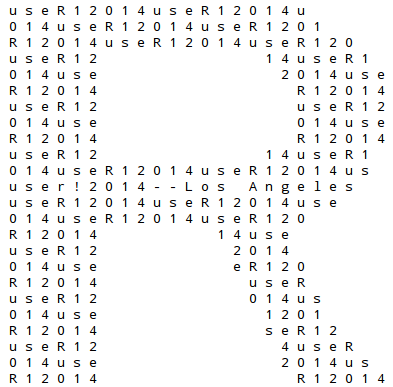

### T-shirt with highlighted code

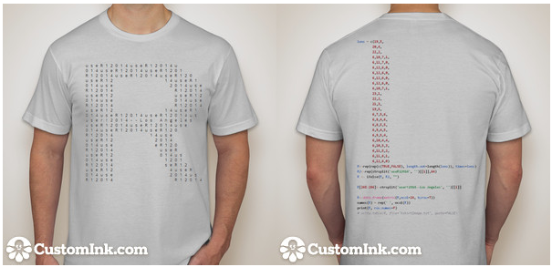

<!-- 2 -->

## [#2](https://github.com/user2014/t-shirt/pull/2) by @daroczig: using pixmap to create ASCII art

As the code will be printed on the t-shirt, maybe it would look cooler with some shorter codebase by using an R package instead of a long, manually defined numeric vector. This also results in a higher resolution ASCII art, although the matrix of course can be reduced.

This pull request has several alternate solutions, here goes a quick list of those and a quick demo of the last one:

 * [ASCII art with saturation](https://github.com/daroczig/t-shirt/blob/2815a42cc48ae631f0440435a6a2e9161fdb5eda/tshirtImage.txt)
 * ["user! 2014" horizontally](https://github.com/daroczig/t-shirt/blob/f21c90fa49f04105732f9930ea8848ff06ace7bd/tshirtImage.txt)
 * [negative](https://github.com/daroczig/t-shirt/blob/533f94feff53ee844023a463cd4ac6f293d0d062/tshirtImage.txt)
 * [final suggestion](https://github.com/daroczig/t-shirt/blob/37c6fd67c283566a343509908949a827934a83ca/tshirtImage.txt)

### Code


library(pixmap)

## get R logo into a matrix
R <- read.pnm(
    system.file('pictures/logo.ppm',
                package = 'pixmap')[1])

## drop colors
R <- addChannels(R)@grey

## create a matrix full of "useR! 2014"
T <- matrix(
    strsplit('useR!2014', '')[[1]],
    nrow = nrow(R),
    ncol = ncol(R),
    byrow = TRUE)

## remove cells not in the R logo
T[which(R > 0.85)] <- ' '

## save to disk
write.table(x = T, # never abbreviate TRUE to T :)
            file = 'tshirtImage.txt',
            row.names = FALSE,
            sep = '',
            col.names = FALSE,
            quote = FALSE)


### Generated image

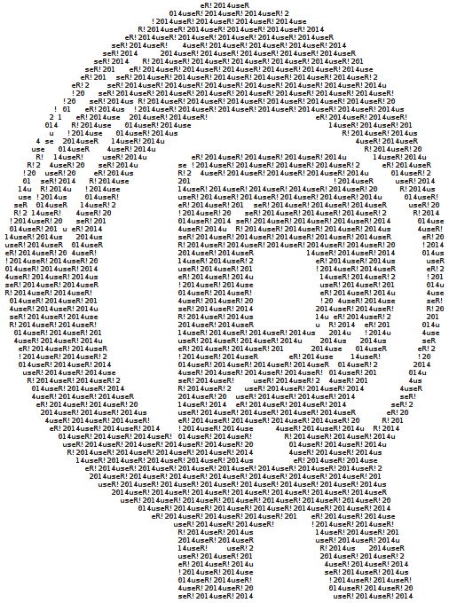

### T-shirt with highlighted code

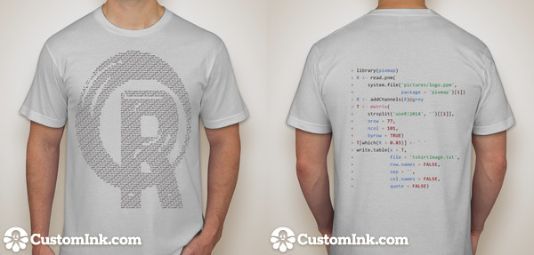

<!-- 3 -->

## [#3](https://github.com/user2014/t-shirt/pull/3) by @bryanhanson: Bayes Icon

### Code


# Bayes Icon Idea
# Inspired by
# http://doingbayesiandataanalysis.blogspot.com/2013/12/icons-for-essence-of-bayesian-and.html
# Bryan Hanson, DePauw University, Greencastle Indiana USA
# May 16, 2014

# This is all fake data designed as a talking point, 
# and suited to be a logo that prints
# well in a limited range of colors, like on a t-shirt!

x1 <- seq(0, 7, by = 0.1) # faux priors/distributions
y1 <- exp(-(x1-3)**2)/sqrt(pi)
y2 <- x1*exp(-x1)

set.seed(7) # faux data points
ns <- 5
x3 <- sample(x1, ns)
y3 <- rnorm(ns, mean = 0.5*diff(range(y2)), sd = 0.1)

mod <- lm(y3~x3) # fit a line

nl <- 3 # faux set of slopes
noise <- rnorm(nl, sd = 0.04)
i <- mod$coef[1] + noise
df <- data.frame(x = 0, y = i)

# empty plot region
plot(x1, y1, type = "n", axes = FALSE, ylab = "", xlab = "")

mods <- list() # add the slopes
for (n in 1:nl) {
	x = c(mean(x3), 0)
	y = c(mean(y3), i[n])
	mods[[n]] <- lm(y~x)
	abline(mods[[n]], lwd = 5, col = "lightblue")
	}

# add the points and distributions
lines(x1, y1, type = "l", col = "blue", lwd = 5)
lines(x1, y2, col = "red", lwd = 5)
points(x3, y3, pch = 20, cex = 3)


### Generated image

### T-shirt with highlighted code

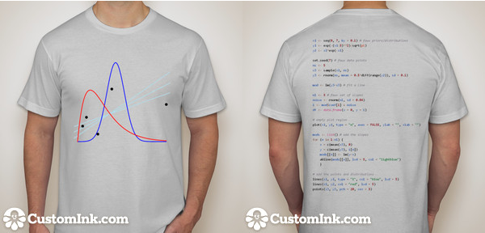

<!-- 4 -->

## [#4](https://github.com/user2014/t-shirt/pull/4) by @fhoces: CLT with R

Very simple demonstration of the CLT using k betas(0.05,0.05). I'm pretty basic about the graphics so any suggestions are welcome.

### Code


dev.off()
set.seed(20140630)

clt = function(n,k) apply(matrix(rbeta(n*k,.05,.05),n, k), 1, sum)/k
plot(density(clt(1000,1)), lwd=.3, ylim=c(0,6.5), main="UseR! L.A. 2014 \n 
Where Combining Independent and Wild Ideas is Normal", xlab="") 
sapply(1:50, function(x) lines(density(clt(1000,x)), lwd=.3, xlab=""))


### Generated image

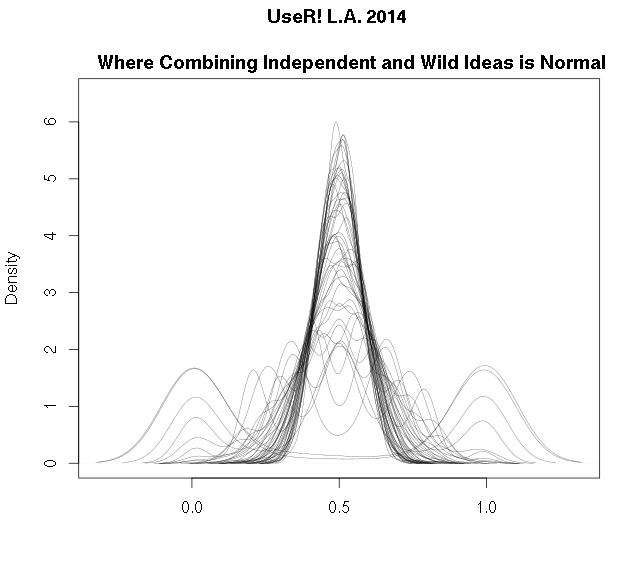

### T-shirt with highlighted code

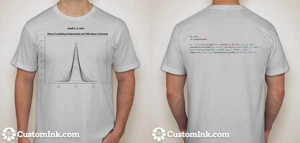

<!-- 5 -->

## [#5](https://github.com/user2014/t-shirt/pull/5) by @MarkTPatterson: EBImage package

### Code


# Script by Mark T Patterson
# May 17, 2014
# twitter: @M_T_Patterson

# General Notes:

# This script creates an image of the R logo 
# represented by n points, 
# where n is the current number of packages on CRAN

# note: this script requries the EBImage package
# available from bioconductor:
# http://bioconductor.wustl.edu/bioc/html/EBImage.html

# approximate run time: 2 mins

#### initialize ####

# clear workspace
rm(list = ls())

# load libraries
library(EBImage) 

# coordinate the version of the program:
set.seed(2014)

#### gather web data: reference image and CRAN package count ####

# load the R logo, save the rgb values:
img = readImage("http://www.thinkr.spatialfiltering.com/images/Rlogo.png")
img.2 = img[,,1:3]

cran.site = "http://cran.r-project.org/web/packages/"
lns = readLines(cran.site)
ref.line = grep(lns, pattern = "CRAN package repository features")
package.count = as.numeric(strsplit(lns[ref.line],split = "\\s")[[1]][7])

#### helper functions ####

# functions for color simplification:
num.to.let = function(x1){
  ref.dat = data.frame(num = 10:15, let = LETTERS[1:6])
  out = as.character(x1)
  if(x1 %in% 10:15){out = as.character(ref.dat$let[which(ref.dat$num == x1)])}
  return(out)
}

rgb.func = function(vec){
  #note: vec is a triple of color intensities
  r1 = floor(255*vec[1])
  g1 = floor(255*vec[2])
  b1 = floor(255*vec[3])
  
  x1 = r1 %/% 16
  x2 = r1 %% 16
  x3 = g1 %/% 16
  x4 = g1 %% 16
  x5 = b1 %/% 16
  x6 = b1 %% 16
  
  x1 = num.to.let(x1)
  x2 = num.to.let(x2)
  x3 = num.to.let(x3)
  x4 = num.to.let(x4)
  x5 = num.to.let(x5)
  x6 = num.to.let(x6)
  
  out = paste("#",x1,x2,x3,x4,x5,x6, sep = "")
  return(out)
  
}

im.func.1 = function(image, k.cols = 5, samp.val = 3000){
  # creating a dataframe:
  test.mat = matrix(image,ncol = 3)
  df = data.frame(test.mat)
  colnames(df) = c("r","g","b")
  df$y = rep(1:dim(image)[1],dim(image)[2])
  df$x = rep(1:dim(image)[2], each = dim(image)[1])
  
  samp.indx = sample(1:nrow(df),samp.val)
  work.sub = df[samp.indx,]
  
  # extracting colors:
  k2 = kmeans(work.sub[,1:3],k.cols)
  
  # adding centers back:
  fit.test = fitted(k2)
  
  work.sub$r.pred = fit.test[,1]
  work.sub$g.pred = fit.test[,2]
  work.sub$b.pred = fit.test[,3]
  
  return(work.sub)
  
}

add.cols = function(dat){
  apply(dat,1,rgb.func)
}

# general plotting function
plot.func = function(dat){
  # assumes dat has colums x, ym cols
  plot(dat$y,max(dat$x) - dat$x, col = dat$cols, 
       main = "A point for each CRAN package",
       xaxt='n',
       yaxt="n",
       xlab = "useR!",
       ylab = "2014",
       cex.lab=1.5, 
       cex.axis=1.5, 
       cex.main=1.5, 
       cex.sub=1.5)
}

#### simplify colors; sample n points ###

temp = im.func.1(img.2, samp.val = 25000, k = 12)
temp$cols = add.cols(temp[,6:8])

final = temp[sample(1:nrow(temp), package.count),]

#### generate plot ####

plot.func(final)


### Generated image

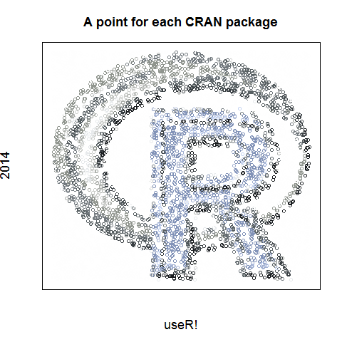

### T-shirt with highlighted code

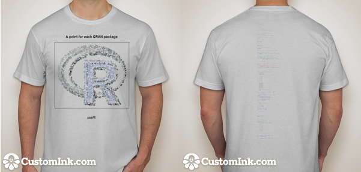

<!-- 6 -->

## [#6](https://github.com/user2014/t-shirt/pull/6) by @calycolor: wordcloud

Sometimes I am so amazed by the visuals created in R that I feel like I am blowing my cereal :)

### Code


# jo f. with thanks to:
# http://is-r.tumblr.com/post/46821313005/to-plot-them-is-my-real-test
# http://stackoverflow.com/questions/12918367/in-r-how-to-plot-with-a-png-as-background
# http://students.washington.edu/mclarkso/documents/figure%20layout%20Ver1.R
# http://georeferenced.wordpress.com/2013/01/15/rwordcloud/

rm(list=ls())
sapply(c("stringr", "jpeg", "RCurl", "EBImage", "wordcloud", "tm"),library, character.only=TRUE)
allImageURLs <- c("http://upload.wikimedia.org/wikipedia/commons/c/c1/Rlogo.png",
				  "http://www.memes.at/faces/cereal_guy_squint.jpg",
				  "http://img2.wikia.nocookie.net/__cb20120912234733/ragecomic/images/9/91/Cereal_Guy_Spitting.jpeg")
imageList <- list()
for(imageURL in allImageURLs) {
	print(imageURL)
   tempName <- str_extract(imageURL,"([[:alnum:]_-]+)([[:punct:]])([[:alnum:]]+)$")
   print(tempName)
   tempImage <- readImage(imageURL) 
   imageList[[tempName]] <- tempImage 
}
par(mfrow=c(2,2))	
plot(0:10, 0:10, type="n", axes=F, ann=FALSE)
rasterImage(imageList[[1]],1,1,10,10)
box("figure", col="black", lwd=2)
plot(0:10, 0:10, type="n", axes=F, ann=FALSE)
rasterImage(imageList[[2]],1,1,10,10)
box("figure", col="black", lwd=2)
useR <- Corpus (DirSource("./useRdir"))
useR <- tm_map(useR, stripWhitespace)
useR <- tm_map(useR, tolower)
useR <- tm_map(useR, removeWords, stopwords('english'))
wordcloud(useR, scale=c(4,1.25), max.words=100, random.order=FALSE, rot.per=0.35, use.r.layout=FALSE, colors=brewer.pal(8,'Dark2'))
box("figure", col="black", lwd=2)
plot(0:10, 0:10, type="n", axes=F, ann=FALSE)
rasterImage(imageList[[3]],1,1,10,10)
box("figure", col="black", lwd=2)


### Generated image

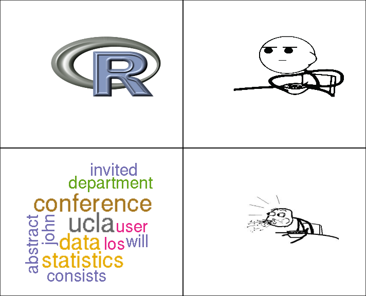

### T-shirt with highlighted code

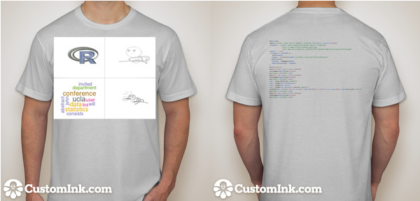

<!-- 8 -->

## [#8](https://github.com/user2014/t-shirt/pull/8) by @woobe: RShapeTarget package

My first attempt based on Pierre's examples in his package "RShapeTarget". Two designs. Note: this is also my first ever pull request :) See you in LA!

### Code


## Load libraries
library(RShapeTarget) # available on https://github.com/pierrejacob/RShapeTarget/
library(rPlotter)     # availalbe on https://github.com/woobe/rPlotter
library(wesanderson)  # available on CRAN

## Set seed for reproducibility
set.seed(1234)

## Define word and colours for logo
txt_logo <- "R"
col_logo <- c("white", "steelblue")  ## Also try wes.palette(4, "GrandBudapest")

## Create a shape from the letter R
path_word <- extract_paths_from_word(txt_logo)

## Create a target with some smoothness parameter lambda
target_word <- create_target_from_word(txt_logo, lambda = 1)

## Generate in a square surrounding the shape
rinit <- function(size)  csr(target_word$bounding_box, size)
x <- rinit(200000)

## Evaluate the log densities associated to these points
logdensities <- target_word$logd(x, target_word$algo_parameters)

## Create a ggplot2 object
g <- plot_paths(path_word) + geom_point(aes(x = x[,1], y = x[,2], alpha = 0.01,
                                            colour = exp(logdensities))) +
  scale_colour_gradientn(colours = col_logo) +
  create_ggtheme("blank") +  # function from rPlotter
  theme(legend.position = "none") # remove legend

## Save as PNG
png(filename = "output_logo.png", width = 2000, height = 2000, res = 300)
print(g)
dev.off()


### Generated image

### T-shirt with highlighted code

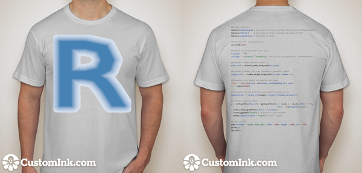

<!-- 9 -->

## [#9](https://github.com/user2014/t-shirt/pull/9) by @hanel: ggplot2 

I added a simple ggplot2 t-shirt image.

### Code


library(ggplot2)
library(grid)

event = data.frame(
  
  DETAILS = c('> Los Angeles', 'California', 'June 30-July 3','2014'),
  NAME = c('u','s','e','R!'), 
  COLOR = factor(c(1, 1, 1, 2), levels = c(1, 2))
  
)

event$DETAILS = factor(event$DETAILS, levels = event$DETAILS)

set.seed(2014)

ggplot(event) + 
  geom_text(aes(x = 0, y=0, label=NAME, color = COLOR,hjust = rnorm(4, 0.5, .2), vjust = rnorm(4, 0.5, .2)), size = rel(35), face = 'bold') + 
  facet_grid(~DETAILS) +
  theme_bw() +
  theme(axis.title = element_blank(), 
        axis.text = element_blank(), 
        axis.ticks = element_blank(), 
        strip.text = element_text(hjust = 0, size = rel(1.25), face = 'bold', color = '#226666', family='mono'),
        strip.background = element_rect(fill = 'white', colour = 'white'),
        panel.background = element_rect(fill = ('#D3EE9E')), 
        panel.border = element_blank(), 
        plot.margin = unit(c(-0.5,1,-1,0), 'lines')) +
  coord_fixed(xlim = c(-3, 3), ylim = c(-2.25, 2.25)) +
  scale_color_manual(guide='none', values = c('#FFFFFE', '#669999'))

ggsave('tshirtImage.png', width = 8.5, height = 2)


### Generated image

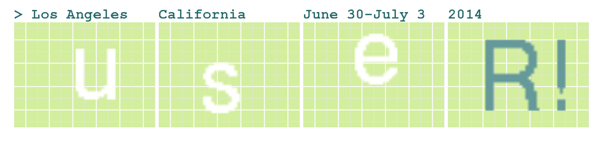

### T-shirt with highlighted code

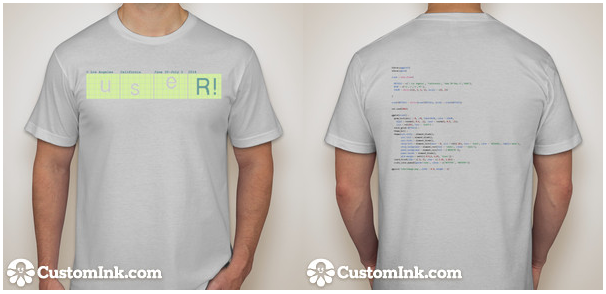

<!-- 10 -->

## [#10](https://github.com/user2014/t-shirt/pull/10) by @royfrancis: RShapeTarget package

### Code


#useR! Design R Script

#load libraries
require(ggplot2)
require(RColorBrewer)
require(Cairo)

#create number of repeats
pos <- c(60,13,14,5,60,17,10,5,63,5,5,5,9,5,63,4,7,5,8,5,63,4,8,4,8,4,64,4,8,5,7,4,64,3,10,4,7,4,64,3,10,4,6,4,64,4,10,4,6,4,64,4,10,4,6,4,7,3,11,2,9,5,12,5,10,4,9,4,7,4,6,4,9,3,9,7,9,8,9,3,10,4,7,3,5,6,9,3,7,2,3,4,7,3,4,4,8,3,9,4,8,3,4,2,1,4,9,3,6,2,6,2,6,3,5,4,7,4,9,4,8,3,3,2,2,3,9,4,6,2,13,3,6,4,7,4,8,4,9,2,8,3,9,4,5,3,12,3,7,4,7,4,6,4,11,2,8,3,9,3,6,3,12,3,7,3,8,12,12,3,7,4,9,3,6,4,10,3,7,3,9,12,12,3,7,3,10,3,6,5,9,3,5,4,9,4,5,4,12,2,8,3,9,4,7,6,6,4,3,4,11,4,5,5,11,2,8,3,8,4,9,6,5,9,13,4,6,4,11,2,7,4,8,4,10,6,4,6,16,4,6,4,11,2,7,4,7,5,11,5,4,3,19,3,8,4,19,3,7,6,12,5,3,3,18,4,8,4,19,3,6,2,1,4,13,4,2,4,18,4,8,5,18,3,5,2,2,3,15,3,2,4,18,4,9,5,16,4,4,2,3,3,3,1,11,3,3,4,9,2,6,4,9,5,6,3,7,4,3,2,4,3,2,2,1,3,7,2,4,4,8,2,7,4,10,5,4,5,6,4,2,2,4,7,2,4,5,3,4,5,5,3,7,5,11,4,4,5,6,7,5,6,3,6,2,3,5,11,8,6,11,5,3,5,6,6,6,5,5,8,8,9,6,12,10,5,1,5,7,3,9,2,8,5,12,4,9,12,13,2,1,4,6)
#create 1s and 0s using repeats
d1 <- rep(rep(c(1,0), length.out=length(pos)), times=pos)
#convert to matrix
d2 <- data.frame(matrix(d1,ncol=92, byrow=T))
#get x coord, y coord and z values
yvec<-vector()
xvec<-vector()
zvec<-vector()
for(i in 1:nrow(d2))
{
  for(j in 1:ncol(d2))
  {
    yvec<-c(yvec,i)
    xvec<-c(xvec,j)
    zvec<-c(zvec,d2[i,j])
  }
}

#create dataframe
d3 <- data.frame(x=xvec,y=yvec,z=zvec)
#remove value 1
d4<-subset(d3,d3$z==0)
#jitter coordinates
d4$x <- jitter(d4$x,4,0.5)
d4$y <- jitter(d4$y,4,0.5)
d4$x1 <- jitter(d4$x,4,0.5)
d4$y1 <- jitter(d4$y,4,0.5)
#random size in 2 layers to increase density
d4$size<-sample(1:9,nrow(d4),replace=T)
d4$size1<-sample(9:16,nrow(d4),replace=T)
#random alpha variation
d4$alpha<-sample(2:4,nrow(d4),replace=T)/10
d4$alpha1<-sample(4:9,nrow(d4),replace=T)/10

#plotting
p<-ggplot()+
  geom_point(data=d4,aes(x=x,y=y,col=x,size=size,alpha=alpha),shape="+")+
  geom_point(data=d4,aes(x=x1,y=y1,col=x,size=size1,alpha=alpha1),shape="+")+
  scale_colour_gradientn(colours= brewer.pal(5,"Set1"),space ="rgb",guide=FALSE)+
  scale_y_reverse()+
  theme_minimal()+
  labs(x="",y="")+
  theme(legend.position="none",axis.text=element_blank(),axis.ticks=element_blank(),panel.grid=element_blank())

#export image #maintain aspect ratio around 1:3
png("useR.png",height=10,width=30,res=200,units="cm",type="cairo")
print(p)
dev.off()


### Generated image

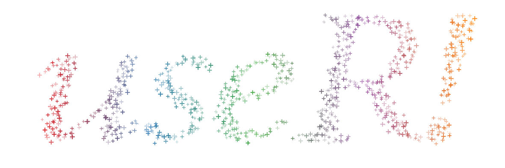

### T-shirt with highlighted code

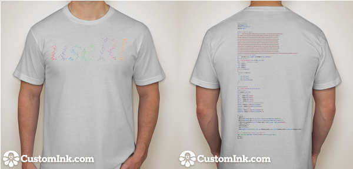

<!-- 11 -->

## [#11](https://github.com/user2014/t-shirt/pull/11) by @notesofdabbler

I wanted to make an attempt building on some of the entries already made. Specifically, I used the first version that had R with letters user2014 and created a version where the letter R is made up of top downloaded R packages (that form the backbone of R). The figure is rough on the edges and the code is a bit too long. Nevertheless, I am putting it here if some aspect of this is found useful by others coming up with more entries.

### Code


# load libraries
library(ggplot2)
library(scales)

# set working directory
setwd("~/notesofdabbler/t-shirt/")

# code taken from github initial commit 
R<-c(rep(1,19),rep(0,5),rep(1,20),rep(0,4),rep(1,22),rep(0,2),rep(1,6),rep(0,10),rep(1,7),0,
     rep(1,6),rep(0,11),rep(1,7),rep(1,6),rep(0,12),rep(1,6),rep(1,6),rep(0,12),rep(1,6), 
     rep(1,6),rep(0,12),rep(1,6),rep(1,6),rep(0,12),rep(1,6),rep(1,6),rep(0,10),rep(1,7),0,
     rep(1,23),0,rep(1,22),rep(0,2),rep(1,21),rep(0,3),rep(1,19),rep(0,5),
     rep(1,6),rep(0,7),rep(1,5),rep(0,6),rep(1,6),rep(0,8),rep(1,4),rep(0,6),
     rep(1,6),rep(0,8),rep(1,5),rep(0,5),rep(1,6),rep(0,9),rep(1,4),rep(0,5),
     rep(1,6),rep(0,9),rep(1,5),rep(0,4),rep(1,6),rep(0,10),rep(1,4),rep(0,4),
     rep(1,6),rep(0,10),rep(1,5),rep(0,3),rep(1,6),rep(0,11),rep(1,5),rep(0,2),
     rep(1,6),rep(0,11),rep(1,6),rep(0,1),rep(1,6),rep(0,12),rep(1,6))

# Create x and y coordinates for plotting letter R
Rx=rep(seq(1,24),24)
Ry=rep(seq(24,1),each=24)
# data for plotting letter R is gathered into a data frame
df=data.frame(R=R,Rx=Rx,Ry=Ry)
# rows with R=0 are not part of the plot
df=subset(df,R==1)
# test of graph with just points
#ggplot(data=df,aes(x=Rx,y=Ry))+geom_point(size=4)

#---------------Finding top downloaded CRAN packages during 3 months (Feb-Apr 2014)-----------------------
# This piece of code is from http://www.nicebread.de/finally-tracking-cran-packages-downloads/  

## ======================================================================
## Step 1: Download all log files
## ======================================================================

# Here's an easy way to get all the URLs in R
start <- as.Date('2014-02-01')
today <- as.Date('2014-04-30')

all_days <- seq(start, today, by = 'day')

year <- as.POSIXlt(all_days)$year + 1900
urls <- paste0('http://cran-logs.rstudio.com/', year, '/', all_days, '.csv.gz')

# only download the files you don't have:
missing_days <- setdiff(as.character(all_days), tools::file_path_sans_ext(dir("CRANlogs"), TRUE))

dir.create("CRANlogs")
for (i in 1:length(missing_days)) {
  print(paste0(i, "/", length(missing_days)))
  download.file(urls[i], paste0('CRANlogs/', missing_days[i], '.csv.gz'))
}

## ======================================================================
## Step 2: Load single data files into one big data.table
## ======================================================================

file_list <- list.files("CRANlogs", full.names=TRUE)

logs <- list()
for (file in file_list) {
  print(paste("Reading", file, "..."))
  logs[[file]] <- read.table(file, header = TRUE, sep = ",", quote = "\"",
                             dec = ".", fill = TRUE, comment.char = "", as.is=TRUE)
}

# rbind together all files
library(data.table)
dat <- rbindlist(logs)

# delete the CRANlogs directory
unlink("CRANlogs",recursive=TRUE)

# find number of downloads of packages
library(dplyr)
pkgcount=dat%>%group_by(package)%>%summarize(downloads=n())%>%arrange(desc(downloads))
# check top 25
#head(pkgcount,25)

#---------------plot letter R with top downloaded package names instead of points-----------------

# number of points in R letter
numptsR=nrow(df)

# The current R letter plot has 342 points
# Extract top 342 downloaded packages
pkgcountTop=pkgcount[1:numptsR,]

# Add info on top packages to dataframe with R letter coordindates
df$package=pkgcountTop$package
df$pkgcount=pkgcountTop$count
df$colornum=seq(1,numptsR) # here just a rank ordering is used for coloring

ggplot(data=df,aes(x=Rx,y=Ry))+
  geom_text(aes(label=package,angle=30,color=as.numeric(colornum)),size=1.5,fontface="bold")+
  theme_bw()+
  theme(axis.ticks=element_blank(),axis.text=element_blank(),legend.position="none",
        plot.background = element_blank(),panel.grid.major = element_blank(),
        panel.grid.minor = element_blank(),panel.border = element_blank())+
  xlab("")+ylab("")+scale_color_gradient2(low="blue",mid="green",high="red",midpoint=floor(numptsR/2))+
  ggtitle("useR!2014")+theme(plot.title=element_text(face="bold.italic",size=10))

ggsave("user2014_tShirt_entry.jpg",width=4,height=4)


### Generated image

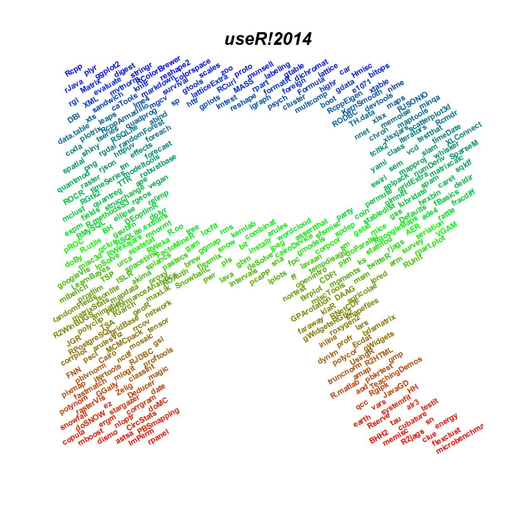

### T-shirt with highlighted code

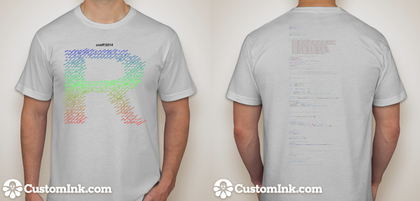

