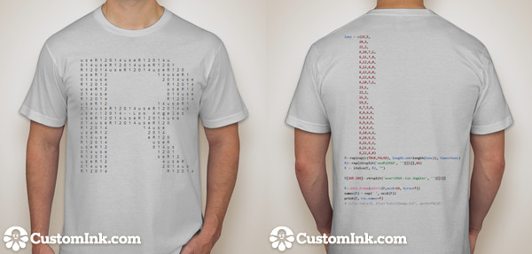

## [#1](https://github.com/user2014/t-shirt/pull/1) by @jimhester

- recycled lengths rather than repeated calls to rep
- formatted lens specification by row
- use strsplit of character string rather than explicit declaration of split characters
- specify byrow in matrix construction rather than transposing post creation
- use spaces for column names rather than dots
- print without row names

### Code


lens = c(19,5,
        20,4,
        22,2,
        6,10,7,1,
        6,11,7,0,
        6,12,6,0,
        6,12,6,0,
        6,12,6,0,
        6,12,6,0,
        6,10,7,1,
        23,1,
        22,2,
        21,3,
        19,5,
        6,7,5,6,
        6,8,4,6,
        6,8,5,5,
        6,9,4,5,
        6,9,5,4,
        6,10,4,4,
        6,10,5,3,
        6,11,5,2,
        6,11,6,1,
        6,12,6,0)
R<-rep(rep(c(TRUE,FALSE), length.out=length(lens)), times=lens)
R2<-rep(strsplit('useR12014', '')[[1]],64)
R <- ifelse(R, R2, "")

R[265:286]<-strsplit('user!2014--Los Angeles', '')[[1]]

R<-data.frame(matrix(R,ncol=24, byrow=T))
names(R) = rep(' ', ncol(R))
print(R, row.names=F)
# write.table(R, file="tshirtImage.txt", quote=FALSE)


### Generated image

### T-shirt with highlighted code

## [#9](https://github.com/user2014/t-shirt/pull/9) by @jimhester

Update tshirt_code.R
simple ggplot2 image

### Code


library(ggplot2)
library(grid)

event = data.frame(
  
  DETAILS = c('> Los Angeles', 'California', 'June 30-July 3','2014'),
  NAME = c('u','s','e','R!'), 
  COLOR = factor(c(1, 1, 1, 2), levels = c(1, 2))
  
)

event$DETAILS = factor(event$DETAILS, levels = event$DETAILS)

set.seed(2014)

ggplot(event) + 
  geom_text(aes(x = 0, y=0, label=NAME, color = COLOR,hjust = rnorm(4, 0.5, .2), vjust = rnorm(4, 0.5, .2)), size = rel(35), face = 'bold') + 
  facet_grid(~DETAILS) +
  theme_bw() +
  theme(axis.title = element_blank(), 
        axis.text = element_blank(), 
        axis.ticks = element_blank(), 
        strip.text = element_text(hjust = 0, size = rel(1.25), face = 'bold', color = '#226666', family='mono'),
        strip.background = element_rect(fill = 'white', colour = 'white'),
        panel.background = element_rect(fill = ('#D3EE9E')), 
        panel.border = element_blank(), 
        plot.margin = unit(c(-0.5,1,-1,0), 'lines')) +
  coord_fixed(xlim = c(-3, 3), ylim = c(-2.25, 2.25)) +
  scale_color_manual(guide='none', values = c('#FFFFFE', '#669999'))

ggsave('tshirtImage.png', width = 8.5, height = 2)


### Generated image

### T-shirt with highlighted code

