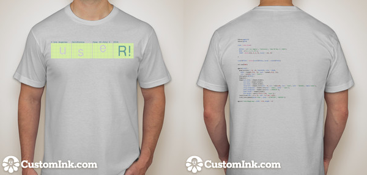

## [#1](https://github.com/user2014/t-shirt/pull/1) by @jimhester

- recycled lengths rather than repeated calls to rep
- formatted lens specification by row
- use strsplit of character string rather than explicit declaration of split characters
- specify byrow in matrix construction rather than transposing post creation
- use spaces for column names rather than dots
- print without row names

### Code


lens = c(19,5,
        20,4,
        22,2,
        6,10,7,1,
        6,11,7,0,
        6,12,6,0,
        6,12,6,0,
        6,12,6,0,
        6,12,6,0,
        6,10,7,1,
        23,1,
        22,2,
        21,3,
        19,5,
        6,7,5,6,
        6,8,4,6,
        6,8,5,5,
        6,9,4,5,
        6,9,5,4,
        6,10,4,4,
        6,10,5,3,
        6,11,5,2,
        6,11,6,1,
        6,12,6,0)
R<-rep(rep(c(TRUE,FALSE), length.out=length(lens)), times=lens)
R2<-rep(strsplit('useR12014', '')[[1]],64)
R <- ifelse(R, R2, "")

R[265:286]<-strsplit('user!2014--Los Angeles', '')[[1]]

R<-data.frame(matrix(R,ncol=24, byrow=T))
names(R) = rep(' ', ncol(R))
print(R, row.names=F)
# write.table(R, file="tshirtImage.txt", quote=FALSE)


### Generated image

### T-shirt with highlighted code

<!-- 2 -->

## [#2](https://github.com/user2014/t-shirt/pull/2) by @daroczig: using pixmap to create ASCII art

As the code will be printed on the t-shirt, maybe it would look cooler with some shorter codebase by using an R package instead of a long, manually defined numeric vector. This also results in a higher resolution ASCII art, although the matrix of course can be reduced.

This pull request has several alternate solutions, here goes a quick list of those and a quick demo of the last one:

 * [ASCII art with saturation](https://github.com/daroczig/t-shirt/blob/2815a42cc48ae631f0440435a6a2e9161fdb5eda/tshirtImage.txt)
 * ["user! 2014" horizontally](https://github.com/daroczig/t-shirt/blob/f21c90fa49f04105732f9930ea8848ff06ace7bd/tshirtImage.txt)
 * [negative](https://github.com/daroczig/t-shirt/blob/533f94feff53ee844023a463cd4ac6f293d0d062/tshirtImage.txt)
 * [final suggestion](https://github.com/daroczig/t-shirt/blob/37c6fd67c283566a343509908949a827934a83ca/tshirtImage.txt)

### Code


library(pixmap)

## get R logo into a matrix
R <- read.pnm(
    system.file('pictures/logo.ppm',
                package = 'pixmap')[1])

## drop colors
R <- addChannels(R)@grey

## create a matrix full of "useR! 2014"
T <- matrix(
    strsplit('useR!2014', '')[[1]],
    nrow = nrow(R),
    ncol = ncol(R),
    byrow = TRUE)

## remove cells not in the R logo
T[which(R > 0.85)] <- ' '

## save to disk
write.table(x = T, # never abbreviate TRUE to T :)
            file = 'tshirtImage.txt',
            row.names = FALSE,
            sep = '',
            col.names = FALSE,
            quote = FALSE)


### Generated image

### T-shirt with highlighted code

<!-- 3 -->

## [#3](https://github.com/user2014/t-shirt/pull/3) by @bryanhanson: Bayes Icon

### Code


# Bayes Icon Idea
# Inspired by
# http://doingbayesiandataanalysis.blogspot.com/2013/12/icons-for-essence-of-bayesian-and.html
# Bryan Hanson, DePauw University, Greencastle Indiana USA
# May 16, 2014

# This is all fake data designed as a talking point, 
# and suited to be a logo that prints
# well in a limited range of colors, like on a t-shirt!

x1 <- seq(0, 7, by = 0.1) # faux priors/distributions
y1 <- exp(-(x1-3)**2)/sqrt(pi)
y2 <- x1*exp(-x1)

set.seed(7) # faux data points
ns <- 5
x3 <- sample(x1, ns)
y3 <- rnorm(ns, mean = 0.5*diff(range(y2)), sd = 0.1)

mod <- lm(y3~x3) # fit a line

nl <- 3 # faux set of slopes
noise <- rnorm(nl, sd = 0.04)
i <- mod$coef[1] + noise
df <- data.frame(x = 0, y = i)

# empty plot region
plot(x1, y1, type = "n", axes = FALSE, ylab = "", xlab = "")

mods <- list() # add the slopes
for (n in 1:nl) {
	x = c(mean(x3), 0)
	y = c(mean(y3), i[n])
	mods[[n]] <- lm(y~x)
	abline(mods[[n]], lwd = 5, col = "lightblue")
	}

# add the points and distributions
lines(x1, y1, type = "l", col = "blue", lwd = 5)
lines(x1, y2, col = "red", lwd = 5)
points(x3, y3, pch = 20, cex = 3)


### Generated image

### T-shirt with highlighted code

<!-- 4 -->

## [#4](https://github.com/user2014/t-shirt/pull/4) by @fhoces: CLT with R

### Code


dev.off()
set.seed(20140630)

clt = function(n,k) apply(matrix(rbeta(n*k,.05,.05),n, k), 1, sum)/k
plot(density(clt(1000,1)), lwd=.3, ylim=c(0,6.5), main="UseR! L.A. 2014 \n 
Where Combining Independent and Wild Ideas is Normal", xlab="") 
sapply(1:50, function(x) lines(density(clt(1000,x)), lwd=.3, xlab=""))


### Generated image

### T-shirt with highlighted code

<!-- 5 -->

## [#5](https://github.com/user2014/t-shirt/pull/5) by @MarkTPatterson: EBImage package

### Code


# Script by Mark T Patterson
# May 17, 2014
# twitter: @M_T_Patterson

# General Notes:

# This script creates an image of the R logo 
# represented by n points, 
# where n is the current number of packages on CRAN

# note: this script requries the EBImage package
# available from bioconductor:
# http://bioconductor.wustl.edu/bioc/html/EBImage.html

# approximate run time: 2 mins

#### initialize ####

# clear workspace
rm(list = ls())

# load libraries
library(EBImage) 

# coordinate the version of the program:
set.seed(2014)

#### gather web data: reference image and CRAN package count ####

# load the R logo, save the rgb values:
img = readImage("http://www.thinkr.spatialfiltering.com/images/Rlogo.png")
img.2 = img[,,1:3]

cran.site = "http://cran.r-project.org/web/packages/"
lns = readLines(cran.site)
ref.line = grep(lns, pattern = "CRAN package repository features")
package.count = as.numeric(strsplit(lns[ref.line],split = "\\s")[[1]][7])

#### helper functions ####

# functions for color simplification:
num.to.let = function(x1){
  ref.dat = data.frame(num = 10:15, let = LETTERS[1:6])
  out = as.character(x1)
  if(x1 %in% 10:15){out = as.character(ref.dat$let[which(ref.dat$num == x1)])}
  return(out)
}

rgb.func = function(vec){
  #note: vec is a triple of color intensities
  r1 = floor(255*vec[1])
  g1 = floor(255*vec[2])
  b1 = floor(255*vec[3])
  
  x1 = r1 %/% 16
  x2 = r1 %% 16
  x3 = g1 %/% 16
  x4 = g1 %% 16
  x5 = b1 %/% 16
  x6 = b1 %% 16
  
  x1 = num.to.let(x1)
  x2 = num.to.let(x2)
  x3 = num.to.let(x3)
  x4 = num.to.let(x4)
  x5 = num.to.let(x5)
  x6 = num.to.let(x6)
  
  out = paste("#",x1,x2,x3,x4,x5,x6, sep = "")
  return(out)
  
}

im.func.1 = function(image, k.cols = 5, samp.val = 3000){
  # creating a dataframe:
  test.mat = matrix(image,ncol = 3)
  df = data.frame(test.mat)
  colnames(df) = c("r","g","b")
  df$y = rep(1:dim(image)[1],dim(image)[2])
  df$x = rep(1:dim(image)[2], each = dim(image)[1])
  
  samp.indx = sample(1:nrow(df),samp.val)
  work.sub = df[samp.indx,]
  
  # extracting colors:
  k2 = kmeans(work.sub[,1:3],k.cols)
  
  # adding centers back:
  fit.test = fitted(k2)
  
  work.sub$r.pred = fit.test[,1]
  work.sub$g.pred = fit.test[,2]
  work.sub$b.pred = fit.test[,3]
  
  return(work.sub)
  
}

add.cols = function(dat){
  apply(dat,1,rgb.func)
}

# general plotting function
plot.func = function(dat){
  # assumes dat has colums x, ym cols
  plot(dat$y,max(dat$x) - dat$x, col = dat$cols, 
       main = "A point for each CRAN package",
       xaxt='n',
       yaxt="n",
       xlab = "useR!",
       ylab = "2014",
       cex.lab=1.5, 
       cex.axis=1.5, 
       cex.main=1.5, 
       cex.sub=1.5)
}

#### simplify colors; sample n points ###

temp = im.func.1(img.2, samp.val = 25000, k = 12)
temp$cols = add.cols(temp[,6:8])

final = temp[sample(1:nrow(temp), package.count),]

#### generate plot ####

plot.func(final)


### Generated image

### T-shirt with highlighted code

<!-- 6 -->

## [#1](https://github.com/user2014/t-shirt/pull/1) by @jimhester

### Code





### Generated image

### T-shirt with highlighted code

<!-- 7 -->

## [#1](https://github.com/user2014/t-shirt/pull/1) by @jimhester

### Code





### Generated image

### T-shirt with highlighted code

<!-- 8 -->

## [#1](https://github.com/user2014/t-shirt/pull/1) by @jimhester

### Code





### Generated image

### T-shirt with highlighted code

## [#9](https://github.com/user2014/t-shirt/pull/9) by @jimhester

Update tshirt_code.R
simple ggplot2 image

### Code


library(ggplot2)
library(grid)

event = data.frame(
  
  DETAILS = c('> Los Angeles', 'California', 'June 30-July 3','2014'),
  NAME = c('u','s','e','R!'), 
  COLOR = factor(c(1, 1, 1, 2), levels = c(1, 2))
  
)

event$DETAILS = factor(event$DETAILS, levels = event$DETAILS)

set.seed(2014)

ggplot(event) + 
  geom_text(aes(x = 0, y=0, label=NAME, color = COLOR,hjust = rnorm(4, 0.5, .2), vjust = rnorm(4, 0.5, .2)), size = rel(35), face = 'bold') + 
  facet_grid(~DETAILS) +
  theme_bw() +
  theme(axis.title = element_blank(), 
        axis.text = element_blank(), 
        axis.ticks = element_blank(), 
        strip.text = element_text(hjust = 0, size = rel(1.25), face = 'bold', color = '#226666', family='mono'),
        strip.background = element_rect(fill = 'white', colour = 'white'),
        panel.background = element_rect(fill = ('#D3EE9E')), 
        panel.border = element_blank(), 
        plot.margin = unit(c(-0.5,1,-1,0), 'lines')) +
  coord_fixed(xlim = c(-3, 3), ylim = c(-2.25, 2.25)) +
  scale_color_manual(guide='none', values = c('#FFFFFE', '#669999'))

ggsave('tshirtImage.png', width = 8.5, height = 2)


### Generated image

### T-shirt with highlighted code

